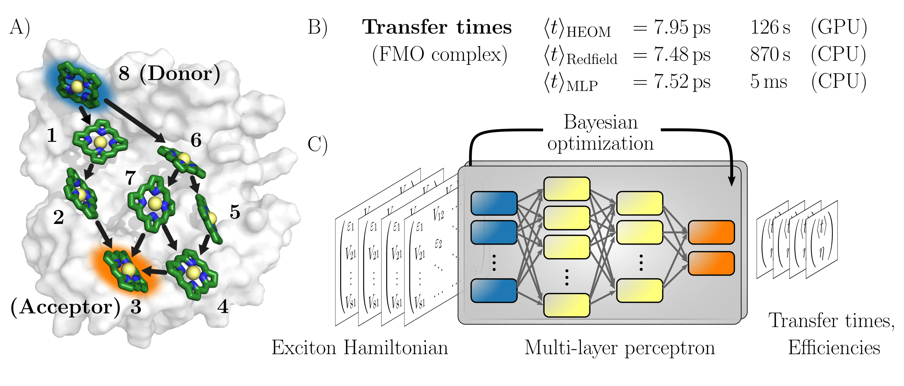

# Deep Learning of Excitation Energy Transfer Properties at Redfield Accuracy

Florian H&auml;se, Christoph Kreisbeck and Alán Aspuru-Guzik
 
 

Conventional numerical schemes for computing the time evolution of open quantum systems such as the hierarchical equations of motion (HEOM) approach or the approximate secular Redfield method are numerically involved and computationally costly. We propose the use of multi-layer perceptrons, a special class of fully-connected feedforward artificial neural networks to bypass the computational limitations of established techniques. 

We demonstrate that MLPs can be trained to predict excitation transfer properties such as average transfer times and transfer efficiencies at the same or even higher level of accuracy as secular Redfield. However, while MLP can predict these properties on the millisecond time scale calculations in the secular Redfield or the HEOM approach take in the order of several minutes up to several hours. 

This repository contains datasets of Frenkel exciton Hamiltonians generated in this study, for which we computed average exciton transfer times and efficiencies in the HEOM and secular Redfield approach. These datasets are contained in the directory `Datasets`. We also provide the parameters of our best performing MLP models as well as an example script to employ the MLP models for transfer time and transfer efficiency predictions. All files necessary for predictions are contained in the directory `MLP_models`.
